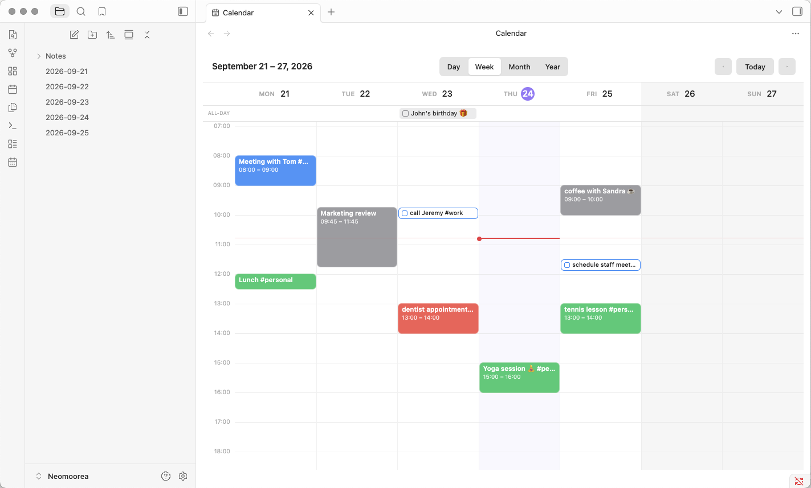
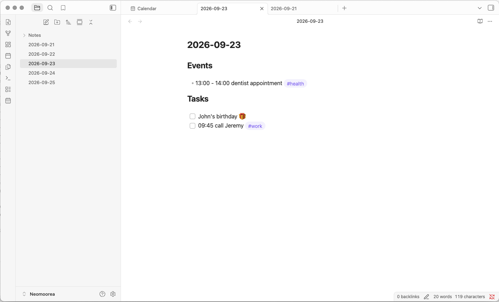

# Daynest

[](LICENSE)
[](https://github.com/Neomoorea/obsidian-daynest/releases/latest)

A modern calendar, nested entirely in your Daily Notes' Markdown.

Daynest adds Year, Month, Week, and Day calendar views to Obsidian. There's
no database, no new file format, and no hidden metadata: every event and
task it shows is read from and written back to plain Markdown inside your existing Daily Notes. Delete the plugin at any point and your
notes stay exactly as readable as they always were.

## Screenshots

  
  

## Why another calendar plugin?

Daynest offers a simple calendar experience that can be used out of the box.
No extensive set up, no metadata, no documentation the size of an encyclopaedia.

Daynest exists because I wanted something narrow: a simple, intuitive calendar experience that reads and
writes nothing but the Daily Notes I already keep, in plain Markdown, with
no properties, IDs, or plugin-only files anywhere in my vault. No sync
service to trust, no separate database to get out of sync with my notes,
and no dozen configuration screens to get through before it does anything
useful.

## Features

- **Four views** — Year, Month, Week, and Day, navigable with the header's
  switcher, arrows, or Today button
- **Nothing but Markdown** — events and tasks are plain
  `- HH:MM - HH:MM Title` and `- [ ] Title` bullets; nothing else is ever
  added to your notes
- **Create, move, and resize by dragging** — draw a new event on the
  timeline, drag an existing one to a new time or day, or drag its edge to
  resize it
- **Tag-based colours** — colour rules match on `#tags` already in your
  titles, with combination rules (`work` + `meeting`) taking priority over
  single-tag ones
- **Daily Notes-aware** — reads your existing Daily Notes (or Periodic
  Notes) folder, filename format, and template, and creates a note
  automatically the moment you add something to a day that doesn't have
  one yet
- **Linked notes** — an event's title can double as a link to another
  note, with an optional alias so the note and the displayed title don't
  have to match
- **Looks like it belongs** — styled with Obsidian's own theme variables,
  so it follows your light/dark mode and accent colour automatically

## The Markdown syntax

Daynest recognises a simple syntax. Everything else in a
Daily Note — including other bullets, headings, and paragraphs — is left
completely untouched.

| What | Syntax | Example |
|---|---|---|
| Timed event | `- HH:MM - HH:MM Title #Tag` | `- 09:00 - 10:00 Team meeting #work` |
| All-day event | *(same shape, spanning your configured working hours)* | `- 08:00 - 18:00 Conference #work` |
| All-day task | `- [ ] Title` | `- [ ] Buy milk` |
| Timed task | `- [ ] HH:MM Title` | `- [ ] 15:30 Buy groceries #personal` |

A completed task uses `- [x]` instead of `- [ ]`.

- **Tags** are just ordinary inline `#tags` anywhere in the title — they
  double as the input to colour rules (see below).
- **Wikilinks** work normally: `- 13:10 - 15:10 [[Project meeting]]` is an
  event whose title *is* a link. Cmd/Ctrl-click it in any calendar view to
  open that note.
- The parser is deliberately strict: `- 09:00 Meeting` (one time, no
  range) and `- This meeting starts at 09:00` are both ordinary Markdown,
  not events.
- An event is treated as **all-day** when its times exactly match your
  configured *working hours*. There's no hidden metadata marking this, so
  changing your working hours later can change how an old all-day event is
  interpreted.

By default, events and tasks live under `## Events` and `## Tasks` headings
(both configurable, and a "single section" mode is available in Settings if
you'd rather not split them). A section runs from its heading to whatever
heading comes next, so it's safe to have other headings and content
elsewhere in the same note.

## Using it

- **Ribbon icon** or **command palette → "Open calendar"** opens the
  calendar in a new tab.
- **Year/Month/Week/Day** switcher, **Today** button, and **◀ ▶** arrows in
  the header. Set **Default view** to "Last used view" in Settings if you'd rather it
  reopen wherever you left it than always the same view.
- **Click a date** (Month/Year) or a **day header** (Week/Day) to open that
  day's Daily Note, creating it from your template if it doesn't exist yet.
- **Click an event or task** to edit it; **Cmd/Ctrl-click** a linked one to
  open its note instead (linked items display their clean title, not the
  `[[brackets]]`). A **✓** on a task toggles it complete directly.
- **The editor** has a **Task** toggle that converts what you're creating
  between a timed event and a checkbox task (it moves it into your
  configured task section on save). Typing a title that starts with
  `- [ ]` or `[x]` does the same thing automatically.
- **Month view:** hover a day for a small **+** button (quick-add, all-day
  by default); drag an item onto another day to move it; "+N more" opens
  that day in Day view.
- **Week/Day view:** click-and-release on an empty slot creates a
  default-length event there and opens the editor; **drag** on an empty
  slot draws a custom time range; **drag an existing event's body** to move
  it, both across time and across days; **drag its top/bottom edge** to resize
  it.
- All of the above is also available as **Obsidian commands** (open the
  command palette and search "calendar"), so you can assign your own
  hotkeys via **Settings → Hotkeys** — "Go to today", "New event", "New
  task", and "Switch to Year/Month/Week/Day view" are all there.
- **Colour rules:** Colours come from **tags**, configured in **Settings → Daynest →
Colours**. A rule matches when an item has *all* of its listed tags; when
several rules match, the one requiring the *most* tags wins (so a
`work + meeting` rule beats a plain `work` rule), and ties go to whichever
rule is higher in your list. Reorder rules with the ↑/↓ buttons.

## Daily Notes integration

Folder, filename format, and template come straight from Obsidian's core
**Daily Notes** plugin (falling back to **Periodic Notes** if that's what
you use instead). Creating an event or task on a date with no note yet
creates that note first, from your template, with `{{date}}`, `{{date:
FORMAT}}`, `{{time}}`, and `{{title}}` substituted — then opens it according
to your "Open Daily Note in" setting.

## Installing it

### Requirements

- Obsidian 1.4.0 or later, desktop or mobile.
- Obsidian's core **Daily Notes** plugin enabled (or the community
  **Periodic Notes** plugin as a fallback) — see
  [Daily Notes integration](#daily-notes-integration).

### Option A — with BRAT (recommended)

1. Install the community plugin **BRAT** (Beta Reviewer's Auto-update
   Tool) from Obsidian's Community Plugins browser, and enable it.
2. Command palette → **BRAT: Add a beta plugin for testing**, and paste in
   `Neomoorea/obsidian-daynest`.
3. Enable **Daynest** under Community plugins.

BRAT also keeps it updated automatically as new releases come out.

### Option B — manual install

1. Go to the [latest release](https://github.com/Neomoorea/obsidian-daynest/releases/latest)
   and download `main.js`, `manifest.json`, and `styles.css`.
2. Create the folder `.obsidian/plugins/daynest/` inside your vault, and
   place those three files in it.
3. In Obsidian, go to **Settings → Community plugins**, click **Reload
   plugins** (or restart Obsidian), then enable **Daynest**.

### Option C — build from source

```bash
npm install
npm run build
```

This produces `main.js` next to `manifest.json` and `styles.css` at the
project root — copy those three files into `.obsidian/plugins/daynest/`
as above. `npm run dev` runs an incremental watch build if you want to
modify the plugin.

## License

MIT — see [LICENSE](LICENSE) for details.
